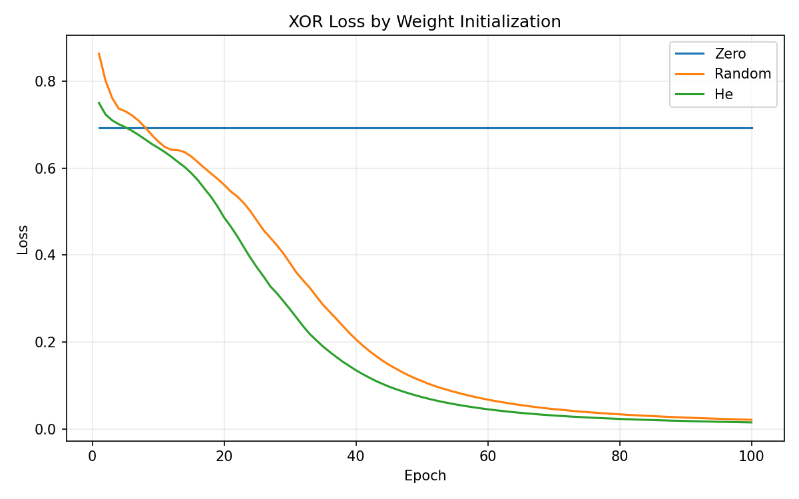

# 실험 리포트

## 실험 목적

동일한 AutoGrad 엔진과 XOR 모델에서 weight 초기화만 변경하여 대칭성 문제와 수렴 속도의 차이를 관찰하고, 실제 MNIST 분류로 엔진의 학습 가능성을 확인했다. 모든 결과는 seed `42`로 재현했다.

## XOR 설정

- 데이터: 네 개의 XOR 표본, full batch
- 모델: `2 → 8 → 1`, ReLU, Sigmoid, Binary Cross Entropy
- 옵티마이저: Adam, learning rate `0.05`
- 비교 조건: Zero, 표준정규 Random, He
- 기록 열: `epoch,loss,accuracy,initialization,seed`

## 초기화 비교 결과

| 초기화 | Epoch 1 loss | Epoch 50 loss | Epoch 100 loss | Epoch 100 accuracy |
|---|---:|---:|---:|---:|
| Zero | `0.693147` | `0.693147` | `0.693147` | `50%` |
| Random | `0.862972` | `0.110663` | `0.021630` | `100%` |
| He | `0.749857` | `0.073749` | `0.015496` | `100%` |

### Zero 초기화 실패

모든 hidden neuron의 weight가 같으면 같은 입력에서 같은 출력을 만들고 같은 gradient를 받는다. 이 대칭성이 깨지지 않아 neuron들이 서로 다른 특징을 학습하지 못한다. 이 실험에서는 ReLU 입력도 모두 0이고 ReLU의 0 지점 gradient를 0으로 정의했으므로 hidden weight가 갱신되지 않았다. 50 epoch 동안 loss는 `0.693147`, accuracy는 `50%`로 완전히 정체되어 실패 조건을 재현했다.

### Random과 He

표준정규 Random은 fan-in을 고려하지 않아 Epoch 1 loss가 `0.862972`로 가장 높았지만 학습은 가능했다. 이 XOR 모델의 첫 층은 입력 차원이 2이므로 He 표준편차가 `sqrt(2 / 2) = 1`로 Random과 같다. 동일 seed에서는 첫 층의 초기 weight 자체도 동일하다. 두 조건의 차이는 Sigmoid에 연결되는 출력층에 있으며, He weight는 Random의 0.5배다. 따라서 이 비교는 해당 모델에서 초기화 조건에 따라 수렴 차이가 발생했음을 보여주지만, ReLU 층에서 He의 분산 유지 효과를 단독으로 입증하지는 않는다. 또한 결과는 seed 42의 단일 조건이므로 초기화 방법의 일반적인 우열을 결론짓지 않는다. 이 설정에서 He는 epoch 50에 loss `0.073749`로 Random의 `0.110663`보다 빨리 감소했고 최종 loss도 낮았다.

Xavier `sqrt(2 / (n_in + n_out))`도 구현했지만 필수 비교 실험에서는 제외했다. Xavier는 Sigmoid/Tanh 계열에서 입력·출력 fan을 함께 고려해 신호 분산을 유지하는 용도다.

## Adam 분석

Adam은 Momentum 계열의 1차 모멘트 `m`으로 gradient 방향의 이동 평균을 추적하고, RMSProp 계열의 2차 모멘트 `v`로 gradient 제곱의 이동 평균을 추적한다. 초기 step에서 두 값이 0에 치우치는 문제를 줄이기 위해 `m/(1-β1^t)`와 `v/(1-β2^t)` bias correction을 적용했다. 매 step 전에 `zero_grad()`를 호출해 이전 mini-batch gradient가 현재 update에 섞이지 않게 했다.

## MNIST 설정과 결과

- 데이터: 표준 MNIST IDX gzip 60,000 train / 10,000 test
- 로딩: `urllib` 다운로드, `gzip` 해제, IDX 헤더·payload 직접 파싱
- 전처리: `float32`, `[0, 1]` 정규화, `784`차원 평탄화
- 모델: `784 → 256 → 10`, ReLU, logits Cross Entropy
- 옵티마이저: Adam, learning rate `0.001`, batch size `128`
- 결과: 1 epoch train loss `0.305141`, test accuracy `95.21%`

기존 `784 → 128 → 10` 모델은 1 epoch에서 `94.30%`에 머물렀다. 은닉층을 `256`개로 늘려 같은 seed와 학습 설정으로 재실험한 결과 `95.21%`를 기록해 Acc `>= 95%` 목표를 통과했다. 첫 실행에서 내려받은 gzip은 `data/`에 캐시되었고, 후속 실행에서 캐시 재사용 메시지를 확인했다.

## 결론

검증 대상 연산·레이어가 Gradient Check를 통과했고, He 조건의 XOR와 MNIST 학습 성공, Zero 조건의 XOR loss 정체를 재현했다. Zero 조건에서는 대칭성과 함께 ReLU의 0 지점 도함수를 0으로 정의한 구현이 hidden weight의 업데이트 정지에 관여한다. Random과 He의 수렴 차이는 앞서 명시한 모델·seed·출력층 초기 스케일 조건에서 관측한 결과다. Gradient Check 통과는 검사한 입력에서의 정확성을 뒷받침하며, 모든 입력·연산에 오류가 없음을 증명하지는 않는다.
